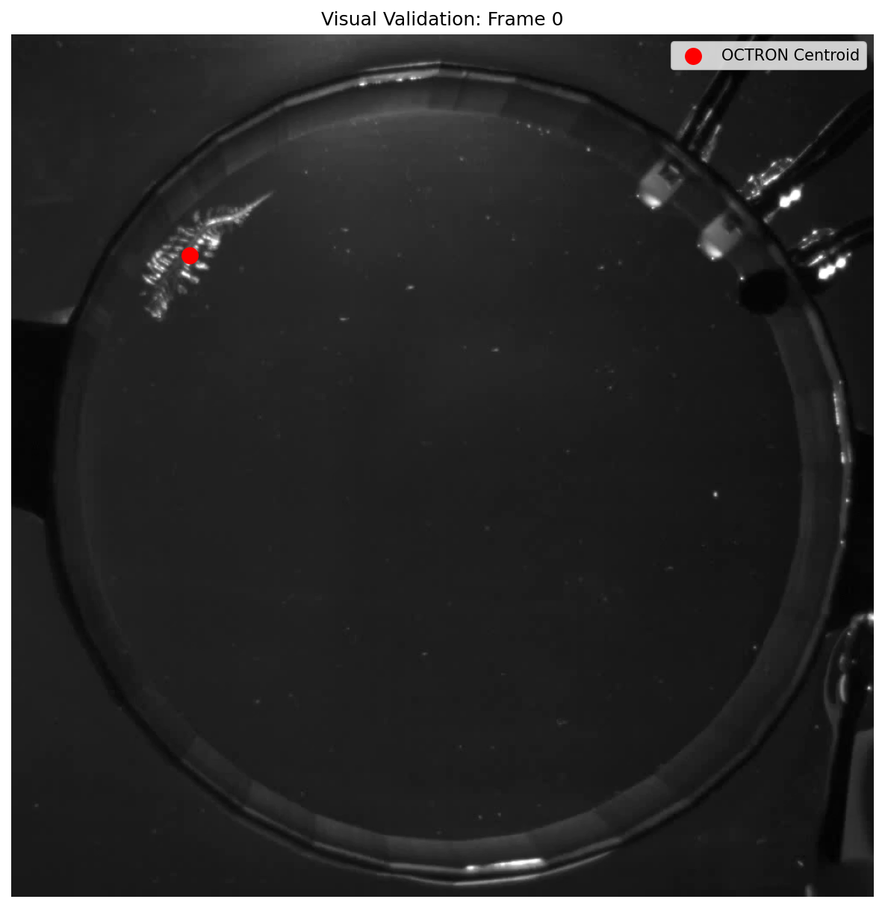

# NIU Movement — Segmentation Tracking PoC

This is my proof-of-concept for the GSoC 2026 project
[Movement: Support for Segmentation Mask Tracking (Issue #301)](https://github.com/neuroinformatics-unit/movement/issues/301).

The goal of the project is to let the [movement](https://github.com/neuroinformatics-unit/movement)
library load tracked segmentation data from tools like
[OCTRON](https://octron-tracking.github.io/OCTRON-docs/) alongside the
kinematics analysis it already supports.

---

## What this repo shows

I built a loader for OCTRON's prediction output and verified it works end-to-end
on Horst's real worm tracking data (`worm_detailed_BotSort`, 842 frames, 1000×1000px, fps=7).

**Memory:** loading the CSV schema into an `xr.Dataset` uses **0.037 MB** of RAM.
Eager-loading all four mask arrays from zarr would use **3,368 MB**.
That's a **90,772× difference** — and the CSV centroid coordinates are
mathematically exact (OCTRON computes them directly from blob detection, not derived).

**Kinematics compatibility:** `compute_velocity`, `compute_path_length`, and
`filter_by_confidence` from movement all work on the dataset with zero changes
to existing functions.

**Visual validation:** the red dot lands exactly on the worm's centroid in frame 0.



---

## Key findings from testing

These are things I discovered by actually running the code on the real data,
which informed the loader design:

1. **fps is nested** — it lives at `meta["video_info"]["fps_original"]`, not at the top level.
   The loader reads this automatically so users don't need to supply it.

2. **CSVs have 7 metadata header lines** before the actual column headers.
   A plain `pd.read_csv()` call fails. The loader detects the real header row
   by scanning for the `pos_x` and `track_id` columns.

3. **`predictions.zarr` is zarr v3** — `xr.open_zarr()` fails with a
   `dimension_names` error. The loader uses `zarr.open()` directly for
   on-demand mask access.

4. **OCTRON tracks multiple classes per video** — the same run produces
   `worm_track_*.csv` and `led_track_*.csv`. The loader takes a `label`
   parameter to select which class to load (e.g. `label="worm"`).

5. **`Literal['OCTRON']` must be added** to the `source_software` annotation
   in `movement/io/load.py` when the loader is merged into movement.

---

## Dataset schema

```
xr.Dataset (ds_type="masks")
├── position      (time, space, individuals)   float32  ← centroid x,y
├── shape         (time, space, individuals)   float32  ← bbox width, height
├── confidence    (time, individuals)          float32
├── area          (time, individuals)          float32  ← mask area in px
├── eccentricity  (time, individuals)          float32  ← body elongation
├── solidity      (time, individuals)          float32  ← curvature/curling
├── orientation   (time, individuals)          float32  ← body angle (rad)
└── attrs:
    ├── source_software: "OCTRON"
    ├── fps: 7.0
    ├── mask_store: "path/to/predictions.zarr"  ← lazy reference
    └── label: "worm"
```

Eccentricity ranges from 0 (circle) to 1 (line). For this worm:
mean=0.932, min=0.879, max=0.971 — it captures elongation changes
during locomotion, which is biologically meaningful.

The `mask_store` attribute points to the existing zarr store.
To access a single frame's mask on demand:

```python
import zarr
store = zarr.open(ds.attrs["mask_store"], mode="r")
mask = store["1_masks"][frame_idx]  # loads only that frame
```

---

## Files

```
notes/
├── utils.py               shared loader — read_octron_csv + build_octron_dataset
├── octron_tests_v2.py     full test suite (A–J), run this first
├── validate_api.py        mathematical proof — dummy CSV with known positions
├── validate_kinematics.py speed sanity check (max 162 px/s, mean 22 px/s)
├── validate_edge_cases.py error handling — wrong label, missing metadata
└── validate_visually.py   generates the screenshot above

docs/
└── visual_validation_frame0.png
```

---

## How to run

```bash
# 1. Install dependencies
pip install -r requirements.txt
pip install -e "path/to/movement[dev]"

# 2. Download Horst's sample data and place the octron_predictions/ folder in the repo root

# 3. Run the test suite
python notes/octron_tests_v2.py

# 4. Run individual validations
python notes/validate_api.py
python notes/validate_kinematics.py
python notes/validate_edge_cases.py
```

---

## Requirements

```
movement (installed from source)
numpy
pandas
xarray
zarr
opencv-python
matplotlib
```

---

*This repo is part of my GSoC 2026 application for the NIU movement project.*
*GitHub: [Roaa-838](https://github.com/Roaa-838)*